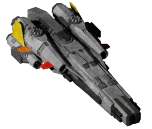

## DAIS: *Daeridanii's Additional Interesting Ships*

A plugin for the open-source space game [Endless Sky](https://www.github.com/endless-sky/endless-sky), adding a collection of fully-modeled ships, many in the design family of an existing vessel or group of vessels. The goal is for these to slot in seamlessly as part of a sort of "vanilla-plus" experience, adding diversity and interest to shipyards and fleets throughout the galaxy without changing up game balance too drastically.

### Current Additions
* **Light Warships**
    * _Lindwurm_: Fast and fanciful, a smaller sibling of the Lionheart Corvette.
    * _Hydrargyrum_: A heavier successor to the Megaparsec Quicksilver with a greater armament.
    * _Rime Branch_: A light warship for the Wanderers. _(Wanderer Military License)_
* **Medium Warships**
    * _Erinys_: A medium warship made by Southbound Shipyards for the Free Worlds to fight alongside their larger Dreadnought. _(Militia License)_
    * _Hekla (Vaba)_: An medium warship built on Thule, the design of which diverged from the mainstream a long time ago.
* **Heavy Warships**
    * _Moonbeam_: The Falcon of yesteryear, a fast heavy warship in the style of the CCOR-era ships. _(Plus a Marauder-esque variant!)_
    * _Catatumbo_: A heavy warship for the Wanderers, the weapons-focused sibling to the Derecho and Hurricane. _(Wanderer Military License)_
* **Utility Craft**
    * _Hekla (Dora)_: An drone carrier built on Thule, the design of which diverged from the mainstream a long time ago.
    * _Reflection_: Rough and tough, a hefty tugboat built to shift large masses. _(Plus a Marauder variant!)_

### Marauders
Currently, both the _Moonbeam_ and _Reflection_ have Marauder-style variants; performance-enhanced versions modified by pirate warlords. Rather than using the vanilla system for acquiring Marauders, these can be obtained *once* as unique ships through missions under certain conditions.

### Other Info
All-content plugin support for testing and cheating is provided through [Omnis](https://www.github.com/DarcyManoel/-Omnis).

Up to date with v0.10.16 of Endless Sky.

### My Plugins
* [**DAIS** _(Ship Collection)_](https://www.github.com/Daeridanii1/DAIS)
* [**Korath Flares Redone**](https://www.github.com/Daeridanii1/korath-flares-redone)
